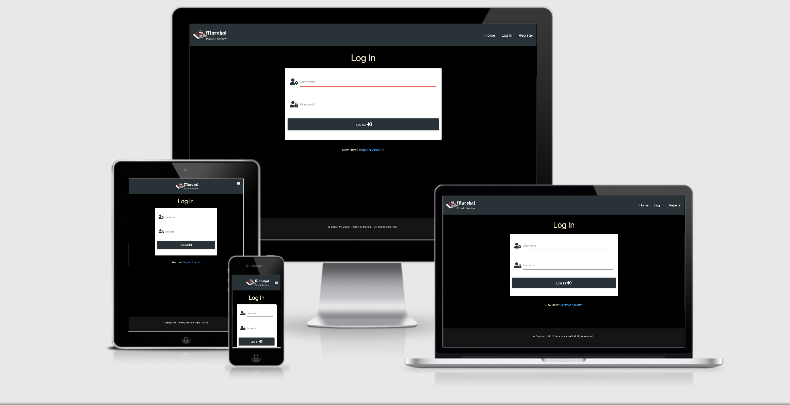
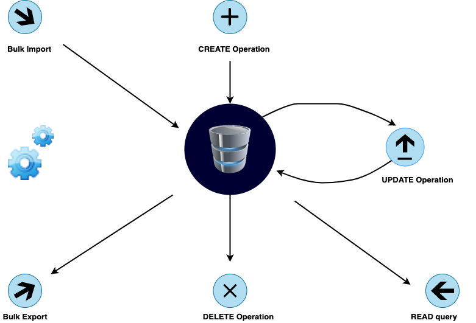
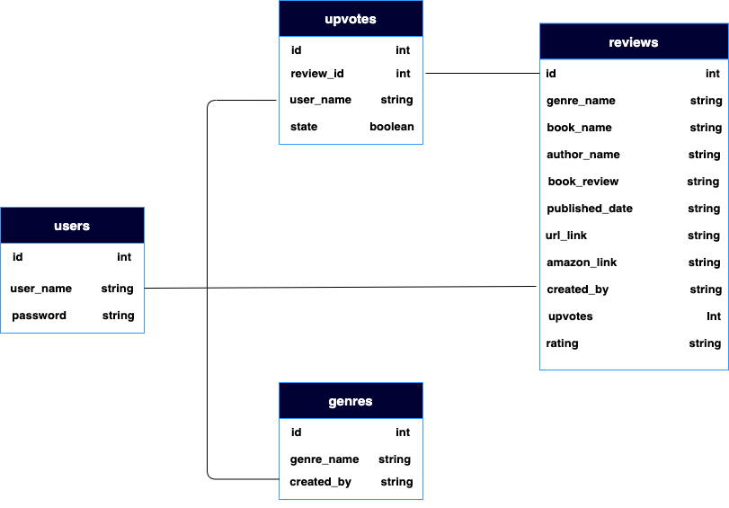
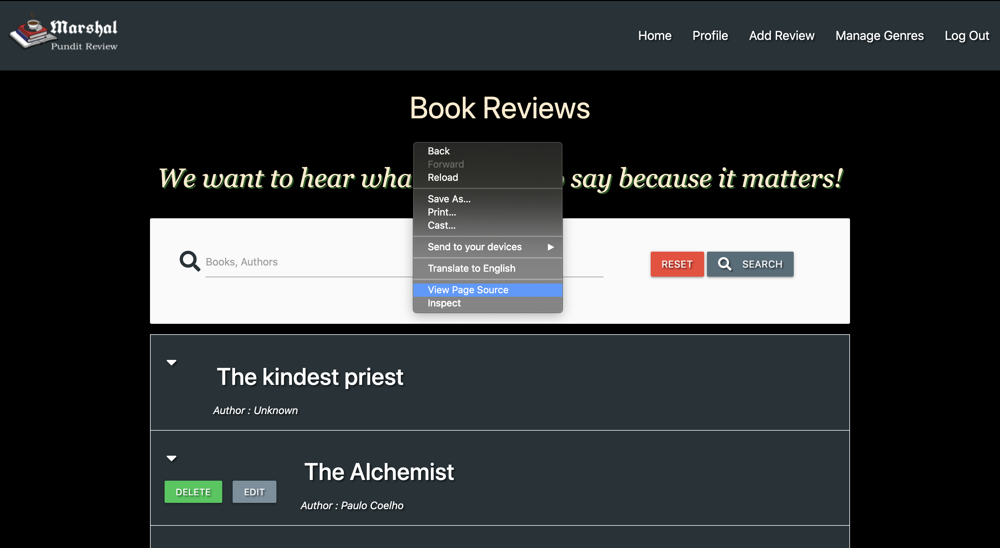
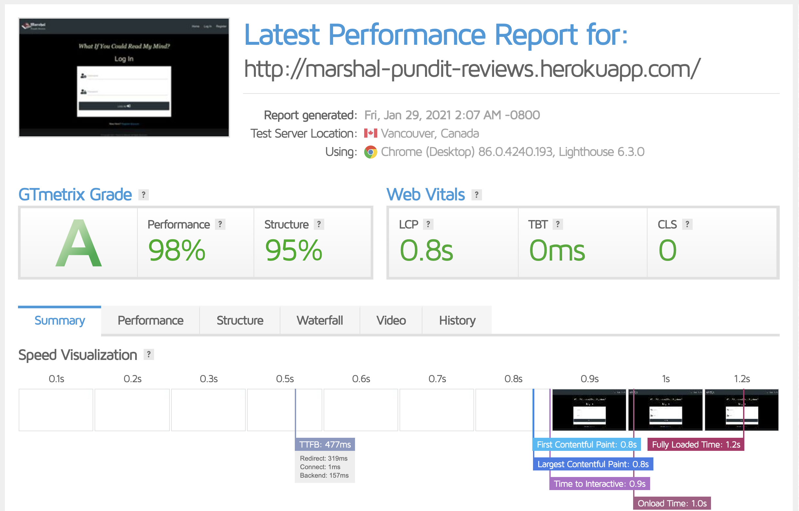

<p id="top"></p>

# MARSHAL PUNDIT REVIEWS WEBSITE

[View live deployment of site here](http://marshal-pundit-reviews.herokuapp.com/)



This is a Data Driven website created to provide the much needed information architecture to address organizational needs for storing,
retrieving, updating and processing exponentially growing data sets.

As our appetites to read, acquire and analyze more books intensified, "Marshal Pundit Book Reviews" emerged.


# Table of Contents

- [UX](#ux)
- [Database](#database)
- [Features](#features)
- [Technologies Used](#technologies-used)
- [Testing](#testing)
- [Deployment](#deployment)
- [Credits](#credits)

_<div align="right"><p style="text-align: right"><a href="#top">Back to top</a></p></div>_

<a name="ux"/>

# UX

## UX Design

The color scheme used in this project is a deviation from the basic "Achromatic" use of a white background with black text in web design yet the motifs were simply structured to be aesthetic and user friendly. All sections are arranged in a logical order to provide intuitive user experience.

The following colors were used: blanchedalmond (`#ffebcd`), range of blue-grey (`#263238`, `#37474f`, `#78909c`), grey lighten-5 (`#fafafa`), amber accent-4 (`#ffab00`), green accent-4 (`#00c853`), red lighten-1 (`#ef5350`), moderate red (`#D05F59`), white (`#ffffff`), black (`#000000`) and very dark (`#121315`).

## Target Audience

This application aims to attract readers, voracious readers, who like to share their thoughts on books they have read, and interact with other readers. The website provides user with synopsis about various genres and reviews, and allows interface for their reactions. Users are also able to upvote or downvote reviews. 

The main objective of the website is to provide users with the functionality to read, add, comment and vote for reviews.

## User Stories

Users:
* As a first time user, I would like to create my own account with the option to login and logout so nobody else can access it.
* As a prospective user, I want to be able to navigate throughout the site with ease to find content and access all collection of reviews in an organised format.
* As a user, I would like to be able to add, share and see all of my inputs within the app (i.e. comments, reviews, votes).
* As a user, I would like to search any particular book quickly using book title or author.
* As a user I would like to be able to like or dislike any review.
* As a user I would like to be able to edit or delete any content added by me.
* As a user I would like to be sure that no other user is able to edit or delete my input. 

Owners:
* As a owner, I want my website to be desirable and accessible to users.
* As a owner, I want to earn money on each book purchased via a link from the site.

## Wireframe
The skeletal framework of this website was designed using [Balsamiq](https://balsamiq.com) as a visual guide to represent the page schematic and screen blueprint.

Links to final version of the wireframe can be found below:

* [Wireframe Final Version](wireframes/marshal-pundit-wireframe.pdf)

_<div align="right"><p style="text-align: right"><a href="#top">Back to top</a></p></div>_

<a name="database"/>

# Database

MongoDB Atlas was used for this project. A leading NoSQL system in document-oriented cloud database.

The functionality was generally structured to action four types of operations, known collectively by the acronym CRUD, standing for Create, Read, Update, and Delete as shown below:



## Database Design

The database integrates four collections, namely: users, genres, reviews and  upvotes as represented in the database schema below:



_<div align="right"><p style="text-align: right"><a href="#top">Back to top</a></p></div>_

<a name="features"/>

# Features

## Existing Features

#### Structure

- **Navbar** - mobile collapse button from Materialize framework was used for the navbar which framed the brand logo and links to relevant sections namely:
 Home, Profile, Add Review, Manage Genres, Sign Out. When the nav bar is resized, you will see that the links on the right turn into a hamburger icon, an effect of `class=sidenav-trigger` functionality. 

- **Footer** - A Sticky-footer was utilized for the purpose of this project because it always stays on the bottom of the page regardless of how little content is on the page.
The footer contains the copyright formality.

#### Forms

- **Register form**: This provides interface to new users for sign up.

- **Log In form**: form that enable users to sign into already created account. 

- **Add Review form**: contain fields that enable users to add new review to the website.

- **Edit Review form**: This form retrieves existing review data for revise.

- **Add Genre form**: form that enable users to add new genre to database.

- **Edit Genre form**: Allows for retrieve and revise of existing genre.

#### Home

* The Home Page offers the **Search bar** which filter books based on the user's query (i.e by name or author)
It contains collapsibles; accordion elements that expand when clicked on. The collapsible-header framed the caret-down, delete and edit buttons for reviews
while the collapsible-body encapsulates the set of data stored about a particular instance of an entity.

* When users get at the button of a long page, they often need to get back to the top.
There is a Back to Top button integration with JavaScript to allow users to quickly navigate to the top of the page.

#### Profile

* The Profile section features exclusively for a user session. 
All collections per user are stored in their respective profile Page and secure to only be available to Account owner

#### Manage Genres

* The Manage Genre section comprises of cards displaying content composed of different genres.
It allows user to add, edit and delete existing genres. but make it secure to only be available to the Account owner.

#### Security

* To make the user authentication more secure, the Log In form integrates werkzeug security features namely: "generate_password_hash" and "check_password_hash".
Hashing passwords makes it tougher to crack.

#### Word Counter

* The reviewers comment input field has a word counter integrated with JavaScript.
The counter display while typing to inform and limit users within the context of maximum length and subject matter.

## Features Left to Implement

* Add social media links to generate traffic.
* Recover username and password option

_<div align="right"><p style="text-align: right"><a href="#top">Back to top</a></p></div>_

<a name="technologies-used"/>

# Technologies Used
**Languages:**
* [HTML5:](https://www.w3schools.com/html/default.asp)
    - HTML5 was used to code the content of the website.
* [CSS:](https://www.w3schools.com/css/default.asp)
    - CSS3 was used to style the content.
* [JavaScript:](https://www.w3schools.com/js/default.asp)
    - JavaScript was used to style the significant interactive functionality.
* [Python:](https://www.w3schools.com/python/default.asp)
    - Python was used for the project back-end functions. Flask and Python is used to build route functions.

**Tools and Libraries:**
* [Materialize:](https://materializecss.com/)
    - Materialize was used to create grid layout and styling various features such as navbar accordion, cards, buttons, forms, and footer to render responsive website.
* [W3C Validator:](https://validator.w3.org/)
    - The W3C Markup Validator and W3C CSS Validator Services were used to validate every page of the project to clear syntax errors.
* [Font-Awesome:](https://fontawesome.com/)
    - Font Awesome was used on all pages throughout the website to add icons for aesthetic and UX purposes.
* [Flask:](https://flask.palletsprojects.com/)
    - web application framework used to create functions with Python that are injected into html templates. 
* [jQuery:](https://jquery.com/)
    - jQuery library was used to simplify the JavaScript.
* [Tinypng:](https://tinypng.com)
    - Tinypng was used to compress the file size of PNG and JPG files.
* [GTmetrix:](https://gtmetrix.com)
    - GTmetrix was used to run speed tests on each page.
* [Pingdom:](https://tools.pingdom.com)
    - Pingdom was used to run speed tests on each page.
* [HTML and CSS Beautifier:](http://minifycode.com/html-beautifier/)
    - HTML and CSS was used to format the codes to make it more readable.
* [JSHint](https://jshint.com/) 
    - Used to test/validate JavaScript Code.
* [PEP8 Online Checker:](http://pep8online.com/)
    - P8P was used to verify that python coding conventions were applied to meet requirements.
* [drawio:](https://app.diagrams.net/)
    - Diagram software used to create the database schema and data manipulation operations diagrams.
* [Git:](https://git-scm.com/)
    - Git was used for version control by utilizing the Gitpod terminal to commit to Git and Push to GitHub.

**External Hosting:**
* [GitHub:](https://github.com/)
    - The project used the GitHub hosting service to save the project in a repository.
* [MongoDB Atlas:](https://www.mongodb.com/)
    - a document-oriented cloud database used to store manage, query and retrieve data set for the app. 
* [Heroku:](https://www.heroku.com/)
    - Heroku platform was used to deploy, manage, and scale the app. 

_<div align="right"><p style="text-align: right"><a href="#top">Back to top</a></p></div>_

<a name="testing"/>

# Testing

Throughout the development process of this project, Chrome DevTools was used for testing variations and simulation of mobile devices.
The Database Creation with MongoDB Atlas and Heroku deployment was very easy because I followed the well implemented course in code institute module.
To validated my Flask pages, I opened each page and right-click to select the **View Page Source** option (on Chrome), then copy the populated code and paste into Markup Validator. 
This was necessary to avoid all errors and warnings related to Jinja templates syntax as they are not recognised by the HTML validator.



## Speed Test

Website was tested on [GTmetrix](https://gtmetrix.com) and [Pingdom](https://tools.pingdom.com) platforms.



## Testing User Stories from User Experience (UX) Section

Users:
* As a first time user, I would like to create my own account with the option to login and logout so nobody else can access it.
    - The **Register form** provides an interface for first time users to sign up.
    - Upon successful registration, user can now login with the **Log In form** into the already created account.
    - To make the user authentication more secure, the Log In form integrates werkzeug security features namely: "generate_password_hash" and "check_password_hash".
      Hashing passwords makes it tougher to crack.
    

* As a prospective user, I want to be able to navigate throughout the site with ease to find content and access all collection of reviews in an organised format.
    - The site has been designed to be intuitive and accessible to user. At the top of each page there is a clean navigation bar, each link describes at what section they will end up at clearly.
    - The collapsibles are behaving as expected. Each collapsible-header has a descriptive metadata. The accordion elements expand when clicked on to display the collapsible-body, 
      making finding and reviewing a particular instances of data easier while allowing you to hide content that is not immediately relevant to the user.

* As a user, I would like to be able to add, share and see all of my inputs within the app (i.e. comments, reviews, votes)
    - Users can make use of the **Add Review form** by clicking **Add review** option in the navbar menu.
    - Users can write comments about any book and upvote (depicted with green thumbs-up icon) or downvote (depicted with red thumbs-down icon)
    - Submitted review and votes can be view by all other users.

* As a user, I would like to search any particular book quickly using book title or author.
    - The Home Page offers the **Search bar** which enables users to search any book by name or author.

* As a user I would like to be able to like or dislike any review.
    - Users can like any review by clicking the green thumbs-up icon or dislike by clicking the red thumbs-down icon.
    - When users like or dislike any review, the page reloads to show upvote or downvote counts respectively.
  
* As a user I would like to be able to edit or delete any content added by me.
    - Each relevant section provides **Edit/Delete buttons** which allow users to revise or delete reviews they added.
    - The **Delete buttons** has a pre-warning pop up modal to alert users of their action.

* As a user I would like to be sure that no other user is able to edit or delete my input.
    - Only authenticated user can edit and delete their content. 
      The **Edit/Delete buttons** appears only on content created per user.
    - The authentication is more secure with hashing making it tougher for hackers to brute-force.
    - Users are only permitted to edit and delete their own reviews, but not any of the reviews submitted by others.

Owners:
* As a owner, I want my website to be desirable and accessible to users.
    - The well detailed composition of the website speaks volume, the colors, the captions, the styling, pop ups and links
     strategically positioned and escalated to desired sections serves to interact with users to determine travel needs and preferences.

* As a owner, I want to earn money on each book purchased via a link from the site.
    - The **Buy Online button** redirect users to amazon site for each review where they can place a purchase order.

## Further Testing

* All links were tested. Internal links all work. External links all work and open in new window.
* The Website was tested on Google Chrome, Internet Explorer, Firefox, Microsoft Edge and Safari browsers.
* The website was test run on a variety of devices such as Desktop, Laptop, iPhoneXR, Samsung Note3, Samsung Tab2 & Nokia.
* The site was test run by friends and colleagues for possible user experience issues and bugs.
* All the pages are responsive on all screen sizes.
* The buttons links as expected and the modal form pops up in sync.
* The Search bar generates corresponding feedback data.
* All Codes passed through their respective Validators to erase syntax error.
* To prevent arbitrary code from running and security flaw, after the development stage, I specify the **debug=False** before submission.

## Bugs

* No known Bugs as at the time of submitting this project.

_<div align="right"><p style="text-align: right"><a href="#top">Back to top</a></p></div>_

<a name="deployment"/>

# Deployment

## Github

This site was developed on GitPod, using git and GitHub to host the repository.
We cannot host a Python project on GitHub Pages it only allows us to host static websites..
Git was used for version control by utilizing the Gitpod terminal to commit to Git and Push to GitHub.

**Note:** It's important to contained our environment variables within a hidden env.py file which should never be pushed to GitHub by ensuring .gitignore has it secured.

## Heroku

When deploying Marshal Pundit Review using Heroku platform, the following steps were taken:

# Create A Heroku App

* Navigated to [Heroku.com](https://www.heroku.com/) in web browser. Once there, clicked on "Sign Up" and created a new account.
* Chose 'Python' as Primary Development Language.
* Selected "**Create new app**" from the Heroku dashboard.
* Filled in the unique app name on the form and selected corresponding region, then clicked on "**Create app**"

# Install Heroku CLI

I used the Heroku command-line interface, within the Terminal:

* To install Heroku, I typed: `npm install -g heroku`
* I typed the login command: `heroku login -i` then login with my already created account details.

# Connect Git remote

we can either link our local Git repository with Heroku, or setup Automatic
Deployment from GitHub.

To link the local Git repository to Heroku:

* I typed: `git status` to check the current state of the repository.
* I typed: `git init` to initialize empty repository (If repository not created already)
* I typed: `git add -A` to add all the files to staging area.
* I typed: `git commit -m "Deployment to Heroku"` to commit changes.
* Then, I typed: `git push -u heroku main` to push code directly to Heroku.

# Adding A requirements.txt File

To add the list of Python dependencies that the project needs in order to run successfully and detect the language:

* I typed: `pip3 freeze --local > requirements.txt` command in the terminal to create a requirements.txt file, 
* Then I typed: `git add -A` 
* Followed by `git commit -m "Add requirements.txt"` to commit changes.
* Finally: `git push -u heroku main` to push file to Heroku.

# Adding A Procfile

To inform Heroku on how to run the application and which file runs it the **Procfile** was installed:

* I typed `echo web: python app.py > Procfile` with a capital 'P' command in the terminal to redirect the echo command.
* Then I typed: `git add Procfile`, 
* Followed by: `git commit -m "Add Procfile` 
* Finally: `git push` to push code to Heroku.

# Creating default environment variables

To add any hidden environment variables, or Config Vars, within our App Settings: 

* Selected **Settings** on Heroku dashboard.
* clicked on **Reveal Config Vars** button.
* Add the key of **"IP"** and the value of **"0.0.0.0"**, and click on Add.
* Add the key of **"PORT"** and the value of **"5000"**, then click Add.
* Add the key of **"SECRET_KEY"** and the value of **"your secret key string here"**, then click Add.
* Add the key of **"MONGO_URI"** and the value of **"mongo URI string here"**
* Finally, add the key of **"MONGO_DBNAME"** and the value of **"the name of your database here"**.

# Setting-up Automatic Deployment from GitHub

To setup Automatic Deployment from GitHub:

* Selected **Deploy** on Heroku dashboard.
* Clicked on **Connect to GitHub** button.
* Ensure my GitHub profile is displayed, then add my repository name (same as my Heroku App), and clicked search.
* Clicked **connect** button once it finds my repo.
* We can now safely **Enable Automatic Deploymentconnect**.
* Selected branch and clicked **Deploy Branch** button.
* Once it's done, you'll see "Your App was successfully deployed!!!.
* Click "**View**" to launch your new app. The deployed site is now available.

## Running Marshal Pundit Reviews Locally
Cloning Marshal Pundit Reviews from GitHub:

* Navigate to '/Seagather/Marshal-Pundit-Reviews'.
* Click the green 'Clone or Download' button.
* Copy the url in the dropdown box.
* Open up your preferred terminal on any IDE of your choice. 
* Navigate to your desired file location.
* Copy the following code and paste to your terminal to clone Marshal Travel Agency.

```
 git clone https://github.com/Seagather/Marshal-Pundit-Reviews.git 

```
_<div align="right"><p style="text-align: right"><a href="#top">Back to top</a></p></div>_


# Credits

## Code
* Inspiration and base code was derived from the Mini Project section of the [Code Institute](https://courses.codeinstitute.net/) course.
Code was modified to better fit my needs. 

## Content
* Reviews, book information and comments are based on two main sources, namely [amazon](https://www.amazon.com/) and [goodreads](https://www.goodreads.com/).

## Media
* [Am I Responsive:](http://ami.responsivedesign.is/) used for UX Image section
* [Unsplash:](https://unsplash.com/) for website images.
* [LogoMaker:](https://logomaker.com) was used for the logo design.

## Acknowledgements
* Special thanks to [Felipe Alarcon](https://github.com/felipe-alarcon), I appreciate more than you' ll ever know
* Most sincere appreciation to my fellow students and Support team at Code Institute for their immeasurable feedback.

_<div align="right"><p style="text-align: right"><a href="#top">Back to top</a></p></div>_
